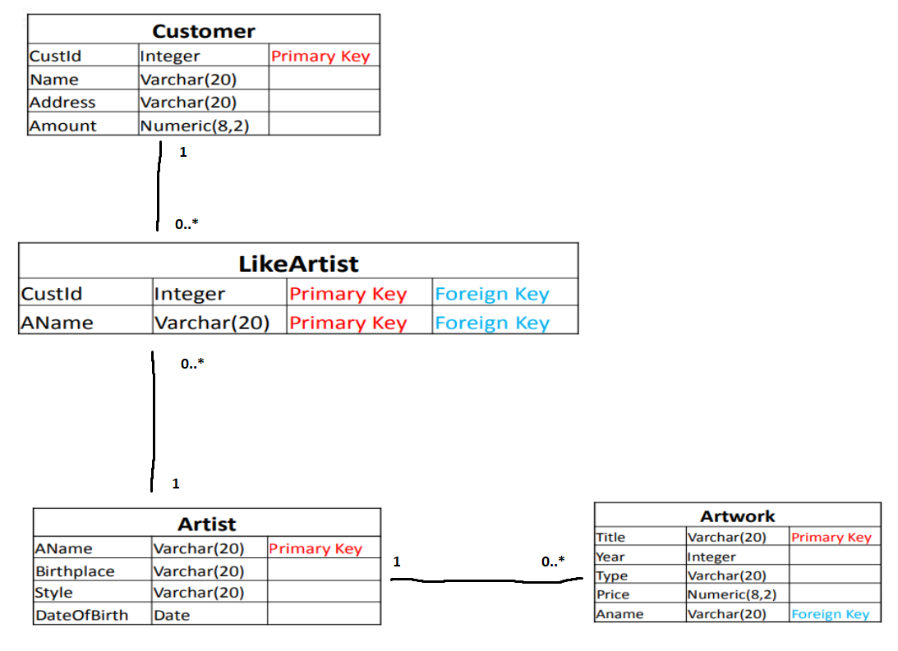
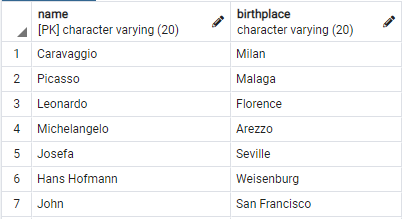
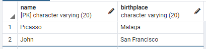
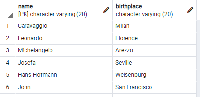
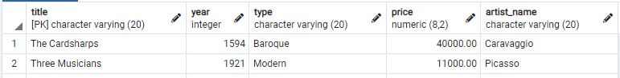
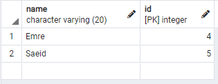

# Description
Repo for CSI 2532 lab 06

# Members
Alexandre Pineau  
300066713

# Lab 06
## Schema Relationnel


## Requetes
### Question 1.
```sql
SELECT name, birthplace
FROM artists;
```


### Question 2.
```sql
SELECT title, price
FROM artworks
WHERE year > 1600;
```


### Question 3.
```sql
SELECT title, type
FROM artworks
WHERE year = 2000 OR artist_name = 'Picasso';
```


### Question 4.
```sql
SELECT name, birthplace
FROM artists
WHERE EXTRACT(YEAR FROM dateofbirth) >= 1880 AND EXTRACT(YEAR FROM dateofbirth) <= 1930;
```


### Question 5.
```sql
SELECT name, birthplace
FROM artists
WHERE style IN ('Modern', 'Baroque', 'Renaissance');
```


### Question 6.
```sql
SELECT *
FROM artworks
ORDER BY title ASC;
```


### Question 7.
```sql
SELECT name, id
FROM customers
WHERE id IN (
	SELECT customer_id
	FROM likeartists
	WHERE artist_name = 'Picasso'
);
```


### Question 8.
```sql
SELECT name
FROM customers
WHERE id IN (
	SELECT customer_id
	FROM likeartists
	WHERE artist_name IN (
		SELECT artist_name
		FROM artworks
		WHERE type = 'Renaissance' AND price > 30000.00
	)
);
```
Aucun résultat