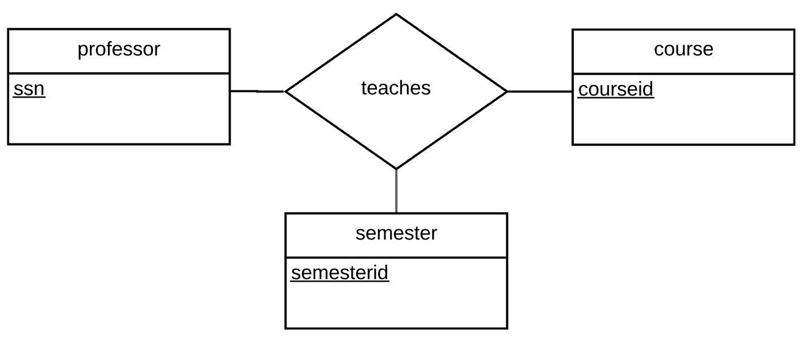

# Description
Repo for CSI 2532 lab 4

# Members
Alexandre Pineau  
300066713

# Lab 04

## Question 1
### Diagramme

### Schéma
```sql
-- SCHEMA POUR LA QUESTION 1

CREATE TABLE professeurs (
    ssn int,
    PRIMARY KEY (ssn)
);

CREATE TABLE cours (
    courseid int,
    PRIMARY KEY (courseid)
);

CREATE TABLE teaches (
    semester int,
    ssn int,
    courseid int,
    PRIMARY KEY (ssn, courseid),
    FOREIGN KEY (ssn) REFERENCES professeurs,
    FOREIGN KEY (courseid) REFERENCES cours
);
```

## Question 3
### Diagramme

### Schéma
```sql
-- SCHEMA POUR LA QUESTION 3

CREATE TABLE professeurs (
    ssn int,
    PRIMARY KEY (ssn)
);

CREATE TABLE cours (
    courseid int,
    PRIMARY KEY (courseid)
);

CREATE TABLE teaches (
    semester int,
    ssn int NOT NULL,
    courseid int NOT NULL,
    PRIMARY KEY (ssn, courseid),
    FOREIGN KEY (ssn) REFERENCES professeurs,
    FOREIGN KEY (courseid) REFERENCES cours
);
```

## Question 5
### Diagramme

### Schéma
```sql
-- SCHEMA POUR LA QUESTION 5

CREATE TABLE professeurs (
    ssn int,
    PRIMARY KEY (ssn)
);

CREATE TABLE cours (
    courseid int,
    PRIMARY KEY (courseid)
);

CREATE TABLE teaches (
    semesterid int,
    ssn int NOT NULL,
    courseid int NOT NULL,
    PRIMARY KEY (semesterid),
    FOREIGN KEY (ssn) REFERENCES professeurs,
    FOREIGN KEY (courseid) REFERENCES cours
);
```

## Question 6
### Diagramme

### Schéma
```sql
-- SCHEMA POUR LA QUESTION 6

CREATE TABLE professeurs (
    ssn int,
    PRIMARY KEY (ssn)
);

CREATE TABLE groups (
    groupid int,
    PRIMARY KEY (groupid)
);

CREATE TABLE member_of (
    ssn int,
    groupid int,
    FOREIGN KEY (ssn) REFERENCES professeurs,
    FOREIGN KEY (groupid) REFERENCES groups
);

CREATE TABLE cours (
    courseid int,
    PRIMARY KEY (courseid)
);

CREATE TABLE teaches (
    semester int,
    groupid int,
    courseid int,
    PRIMARY KEY (groupid, courseid),
    FOREIGN KEY (groupid) REFERENCES groups,
    FOREIGN KEY (courseid) REFERENCES cours
);
```


